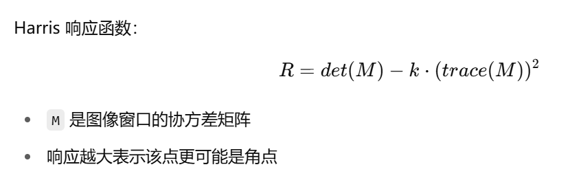

### What is ORB?

#### *Baseline 让我学到了很多，什么是EDA 以及 什么是ORB*
  - 顾名思义，EDA:Exploratory Data Analysis,即是探索性数据分析,在任何机器学习或计算机视觉项目中，第一步都是深入了解数据本身。EDA 通过统计汇总与可视化，帮助你发现数据的分布、异常点、缺失情况以及潜在规律，从而为后续的算法设计与参数调优打下坚实基础。说人话就是用seaborn,plt可视化数据
  - 那么ORB又是啥呢? Oriented FAST and Rotated BRIEF即是一种高效、旋转鲁棒的局部特征检测与描述算法，常用于实时视觉系统与大规模图像匹配任务
  - ORB的结构组成:
    - FAST 关键点检测：快速定位图像中的兴趣点（角点）。

    - Harris 响应筛选：从 FAST 检测结果中筛选出最具代表性的 N 个关键点。

    - 方向分配：计算每个关键点邻域的灰度梯度直方图，选取主方向，以保证旋转不变性。

    - BRIEF 描述符：在主方向对齐后的邻域内，使用一系列二元灰度比较构建紧凑的二进制特征向量
   
#### ORB超级基础使用
```python
# Initialize ORB detector
orb = cv2.ORB_create()

# Detect keypoints and descriptors
kp1, des1 = orb.detectAndCompute(img1, None)
kp2, des2 = orb.detectAndCompute(img2, None)

# Initialize Brute-Force Matcher and match descriptors
bf = cv2.BFMatcher(cv2.NORM_HAMMING, crossCheck=True)
matches = bf.match(des1, des2)

# Sort matches by distance (lower distance = better match) 
matches = sorted(matches, key=lambda x: x.distance) 

# Draw matches
match_img = cv2.drawMatches(img1, kp1, img2, kp2, matches[:50], None, flags=cv2.DrawMatchesFlags_NOT_DRAW_SINGLE_POINTS)

#show match_img .......
```


### HOW ORB WORKS — STEP BY STEP   

1.Detect Keypoints using FAST   
ORB starts by finding keypoints in the image — these are places that stand out (like corners).     
It uses an algorithm called FAST (Features from Accelerated Segment Test), which is super fast and efficient.   
2.Rank Keypoints with Harris Score   
Once ORB finds many keypoints, it ranks them using a method called the Harris corner measure — this helps ORB pick the most unique and stable points to work with.   

### 什么是Harris角点计算方法？其中的k是什么？ 



